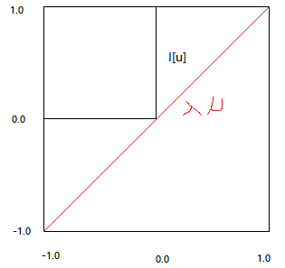
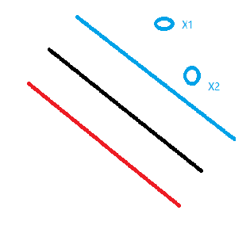
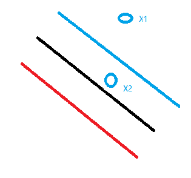

# SVM

[TOC]

## 线性可分支持向量机及优化目标

SVM是一个二分类模型，寻找一个超平面，最大化正负类样本到该平面的最小间隔。

样本特征记为 $\vec X$ ， 正类样本的标记为 $+1$，负类样本的标记为$-1$。

超平面
$$
\vec W \cdot \vec X + \vec b = 0
$$

所以

对正类样本有 
$$
\vec W \cdot \vec X_+ + \vec b \ge 1
$$

对负类样本有
$$
\vec W \cdot \vec X_- + \vec b \le -1
$$

支持向量则有 

$$
\vec W \cdot \vec X_+ + \vec b = 1 \\
\vec W \cdot \vec X_- + \vec b = -1
$$
正负边界之间的距离记为 $Width$

根据余弦定理可知
$$
\begin{aligned}\frac{Width}{||\vec X_+ - \vec X_-||}&=\frac{\vec W \cdot (\vec X_+ - \vec X_-)}{||\vec W||\times||\vec X_+ - \vec X_-||} \\
Width&=\frac{\vec W \cdot (\vec X_+ - \vec X_-)}{||\vec W||} \\
Width&=\frac{(1-b) - (-1-b)}{||\vec W||} \\
Width&=\frac{2}{||\vec W||}
\end{aligned}
$$

所以优化目标为
$$
\begin{aligned}
&max_{w,b} \frac{2}{||\vec W||} \\
等价于\quad&min_{w,b} \frac{1}{2}||\vec W||^2 \\
s.t.\quad&y_i * (\vec W \cdot \vec X_i + \vec b) \ge 1, \forall i \in 1, 2, 3......N
\end{aligned}
$$

---

## 拉格朗日对偶

考虑优化如下问题

$$
\begin{aligned}
&min f_0(x) \\
s.t. \quad &f_i(x) <= 0, \forall i \in 1, 2, 3......N
\end{aligned}
$$

该问题可转化为
$$
J(x)=\left\{\begin{aligned}f_0(x)&,f_i(x)\le0\forall i \\\infty&, otherwise\end{aligned}\right. \\
=f_0(x) + \sum_iI[f_i(x)] \\
$$

$$
I[u] = \left\{\begin{aligned}0, \quad if \quad u \le 0 \\ \infty, \quad otherwise\end{aligned}\right.
$$

对违背约束条件的情况，有正无穷的惩罚。优化该问题依旧困难，所以考虑使用  $\lambda \mu$  来处理，其中 $\lambda > 0$ 表示朝着 $+\infty$ 方向惩罚。（因为$\lambda \mu >= 0$ ）

$\lambda \mu$ 是 $I[u]$ 的下界，当 $\lambda \rightarrow + \infty$ 时，在 $\mu \ge 0$ 范围内， $\lambda \mu \rightarrow + \infty$ 。与 $I[u]$ 等价。见下图：

优化问题可以转为

$$
L(x, \lambda) = f_0(x) + \sum_{i}^{N}\lambda_if_i(x).\quad\forall i \in 1,2,3...N, \lambda \ge 0
$$
这就是拉格朗日乘子法。

因为$\lambda \mu$ 是 $I[u]$ 的下界，且 $\lambda \rightarrow + \infty$时，$\lambda \mu \rightarrow + \infty$ 即$\lambda \mu= I[u]$

所以 $max_{\lambda}L(x, \lambda) = J(x)$。

我们的目标是$min_{x}J(x)$，所以问题可转化为$min_xmax_{\lambda}L(x, \lambda)$

设 $max_{\lambda}min_xL(x, \lambda)$，且$g(\lambda) = min_xL(x, \lambda)$

$max_{\lambda}min_xL(x, \lambda) = max_{\lambda}g(\lambda)$

$L(x, \lambda)$是关于$\lambda$的仿射函数，又因为$\lambda >= 0$，所以$g(\lambda)$是凹的，所以$max_{\lambda}g(\lambda)$是一个凸优化问题。

下面说明$max_{\lambda}min_xL(x, \lambda)$与$min_xmax_{\lambda}L(x, \lambda)$之间的关系，以及$g(\lambda)$是对偶问题。

$L(x, \lambda) \le J(x) \quad \forall \lambda \ge 0$ 

=>    $min_xL(x, \lambda) = g(\lambda) \le min_xJ(x) = p^*$    

=>    $d^* = max_{\lambda}g(\lambda) \le p^*$ 

$p^*$为原问题的最优解。

$d^*$为$max_{\lambda}g(\lambda) $的最优解。

因为$\lambda \rightarrow + \infty$时，$\lambda \mu \rightarrow + \infty$，所以$max_{\lambda}g(\lambda)  \rightarrow J(x)$

又因为$max_{\lambda}L(x, \lambda) = J(x)$

所以
$$
max_{\lambda}min_xL(x, \lambda) \le min_xmax_{\lambda}L(x, \lambda) \quad \lambda \ge 0
$$

---

## KKT 条件

考虑如下问题

最优化 
$$
\begin{aligned}
&f_0(x) \\
s.t. \quad&f_i(x) \le 0 \quad \forall i \in 1,2......N \\
s.t. \quad&h_j(x) = 0 \quad \forall j \in 1,2......M
\end{aligned}
$$

该问题的KKT条件是:
$$
\begin{aligned}
1.&\quad 0 \in \partial f_0(x) + \sum_i^N\lambda_i \partial f_i(x) + \sum_j^M\mu_j \partial h_j(x) \qquad&驻点\\
2.&\quad \lambda_if_i(x) = 0 \quad \forall i \in 1,2......N \qquad &互补松弛条件\\
3.&\quad f_i(x) \le 0, h_j(x) = 0 \qquad \forall i \in 1,2......N, \forall j \in 1,2......M \qquad&原始可行域\\
4.&\quad \lambda_i \ge 0 \qquad \forall i \in 1,2......N\qquad&对偶可行域 \end{aligned}
$$
4是优化必须满足的条件，后面再详细说明。

KKT是最优解$x^*$的充要条件的证明，主要证明条件1，2.

先证明必要性：

假设$x^*, \lambda^*, \mu^*$是原始问题和对偶问题在可行域的最优解，记对偶问题为$g(\lambda, \mu)$。
$$
\begin{aligned}
g(\lambda, \mu)&=min_xL(x, \lambda^*, \mu^*)\qquad&(1)\\

&=min_xf_0(x) + \sum_j^N\mu^*_jh_j(x) + \sum_i^M\lambda^*_if_i(x)\qquad&(2)\\
    
&\le f_0(x^*) + \sum_j^N\mu^*_jh_j(x^*) + \sum_i^M\lambda^*_if_i(x^*)\qquad&(3)\\
    
&\le f_0(x^*)\qquad&(4)
\end{aligned}
$$
(2)->(3)取等号的条件是 $\lambda_i^*f_i(x^*) = 0$ 所以满足KKT条件2

(3)->(4)成立的原因是$\lambda_i \ge 0 \qquad \forall i \in 1,2......N$

因为是最优解，所以在$x^*$处，一定有导数为0，所以KKT条件1成立。

条件3是原始问题约束，成立。

条件4成立。

再证明充分性：

如果$x^*, \lambda^*, \mu^*$满足KKT条件，记对偶问题为$g(\lambda, \mu)$。
$$
\begin{aligned}
g&=g(\mu^*, \lambda^*)\qquad&(1)\\
&=min_xf_0(x) + \sum_j^N\mu_jh_j(x) + \sum_i^M\lambda_if_i(x)\qquad&(2)\\
&=f_0(x^*) + \sum_j^N\mu_jh_j(x^*) + \sum_i^M\lambda_if_i(x^*)\qquad&(3)\\
&=f_0(x^*)\qquad&(4)
\end{aligned}
$$
(1),(2)根据定义获得。

(2)->(3)是因为KKT条件1，所以在$x^*$出取得极值。

(3)->(4)是因为KKT条件2。

综上所以，KKT条件是目标函数在约束条件下取得极值的充分必要条件。

下面说明为什么KKT乘子$\lambda_i \ge 0 \qquad \forall i \in 1,2......N$

当取得极值时，$\nabla f_0(x) + \sum_j^N\mu_j\nabla h_j(x) + \sum_i^M\lambda_i\nabla f_i(x) = 0$

目标函数得梯度方向指向优化的方向，约束条件的梯度指向约束的方向。

假如$\nabla f_0(x)$与$\nabla f_i(x), \nabla h_j(x)$同向，那么$x$还可以沿着梯度的方向移动很小的一部分，并且既能够满足在可行域内，又能够朝着最优化的方向优化目标函数，所以此时的$x$并不是最优解。

所以只有在$\nabla f_0(x)$与$\nabla f_i(x), \nabla h_j(x)$异向时，才达到最优解，此时KKT乘子$\mu_j \ge 0 \qquad \forall j \in 1,2......N$

---

## 松弛变量

对于一些有噪点的数据，使用硬间隔不可分，或者分隔效果不好（正负类间隔不大，而最好的情况是间隔最大化）。此时引入松弛变量$0 \le \xi \le 1$，并修改约束条件为 $y * (\vec W \cdot \vec X + \vec b) \ge 1 - \xi$

优化目标调整为
$$
\begin{aligned}
&min_x \frac{1}{2}||w||^2 - C\sum_i^n\xi_i \\
s.t. \quad&y_i * (\vec W \cdot \vec X_i + \vec b) \ge 1 - \xi_i \qquad \forall i \in 1,2......N\\
&0 \le \xi \le 1
\end{aligned}
$$
其中$C > 0$，是超参数，作为惩罚因子，$C$越大，对于错误分类的惩罚越大。

通过拉格朗日乘子法，可得
$$
L(w, b, \alpha, \mu, \xi) = \frac{1}{2}||w||^2 + C\sum_i^n\xi_i - \sum_i^n\alpha_i[y_i*(w \cdot x + \vec b) - 1 + \xi_i] - \sum_i^n\mu_i\xi_i
$$
由

$\frac{\partial L}{\partial \xi_i} = 0$,$\frac{\partial L}{\partial w} = 0$,$\frac{\partial L}{\partial b} = 0$,$\frac{\partial L}{\partial \alpha_i} = 0$,$\frac{\partial L}{\partial \mu_i} = 0$

可得
$$
C-\alpha_i - \mu_i = 0，\\
又因为\alpha_i \ge 0, \mu_i \ge 0，\\
所以 0 \le \alpha_i \le C
$$

$$
w = \sum_i^n\alpha_iy_ix_i
$$

$$
\sum_i^n\alpha_iy_i = 0
$$

$1-\xi_i-y_i*(\vec W \cdot \vec X + \vec b) = 0$  （KKT约束条件1满足该条件）此时该样本在间隔边界上

$\xi_i = 0$（KKT约束条件2满足该条件）此时该样本在间隔边界上

目标是 
$$
max_\alpha min_{w, b, \xi} L(w, b, \alpha, \mu, \xi) = \frac{1}{2}||w||^2 + C\sum_i^n\xi_i - \sum_i^n\alpha_i[y_i*(\vec W \cdot \vec X + \vec b) - 1 + \xi_i] - \sum_i^n\mu_i\xi_i
$$
先求对$w, b, \xi$的极小，再求对$\alpha$的极大，将(8),(9),(10)带入(7)即得到对偶问题
$$
\begin{aligned}
&\frac{1}{2}||w||^2 + \sum_i^n\alpha_i - \sum_i^n\alpha_iy_ix_iw - \sum_i^n\alpha_iy_ib\\
=&\frac{1}{2}\sum_i^n\alpha_iy_ix_i\sum_j^n\alpha_jy_jx_j + \sum_i^n\alpha_i - \sum_i^n\alpha_iy_ix_i\sum_j^n\alpha_jy_jx_j\\
=&\sum_i^n\alpha_i - \frac{1}{2} \sum_i^n \sum_j^n \alpha_iy_ix_i\alpha_jy_jx_j\\
s.t. &\quad \sum_i^n\alpha_iy_i = 0\\
s.t. &\quad 0 \le \alpha_i \le C \qquad \forall i \in 1,2......N 
\end{aligned}
$$

---

## 核技巧

线性不可分时，使用线性支持向量机无法分离数据。此时寻找映射函数将数据进行转换或者升到高维空间，又变成线性可分数据。

前面的小节得到 $w = \sum_i^n\alpha_iy_ix_i$

所以对样本的预测可写为
$$
 y = \sum_i^n\alpha_iy_ix_ix + \vec b   
$$

同时，目标优化问题是
$$
\sum_i^n\alpha_i - \frac{1}{2} \sum_i^n \sum_j^n \alpha_iy_ix_i\alpha_jy_jx_j
$$

可以看出无论是训练优化的过程还是预测过程，我们需要计算的是样本之间的向量内积。

假如将数据升维的函数为 $\phi(x)$ ，那么

(12)变为 
$$
y = \sum_i^n\alpha_iy_i\phi(x_i)\phi(x) + \vec b
$$

(13)变为 
$$
\sum_i^n\alpha_i - \frac{1}{2} \sum_i^n \sum_j^n \alpha_i\alpha_jy_iy_j\phi(x_i)\phi(x_j)
$$

此时可继续使用线性支持向量机寻找分离超平面。

但是寻找合适的转换或者升维函数并不容易，寻找映射函数的目的是为了使数据线性可分，具体的计算步骤是先映射，再求内积，就得到映射后的结果。可见最终的目标是求内积，假如有一个函数可直接得到这个内积，从而跳过映射函数，问题就很好解决了，这就是核技巧的作用。核函数可用来求解目标函数/预测函数中样本的向量内积，帮助我们省略映射函数的选择。

所以

(14)变为 
$$
y = \sum_i^n\alpha_iy_iK(x_i,x) + \vec b
$$

(15)变为 
$$
\sum_i^n\alpha_i - \frac{1}{2} \sum_i^n \sum_j^n \alpha_i\alpha_jy_iy_jK(x_i, x_j)
$$

常用的核函数有三种：

1.线性核函数 Linear Kernel
$$
 K(\vec x_i, \vec x_j) = \vec x_i^T \cdot \vec x_j 
$$

2.多项式核函数 Polynomial Kernel

$$
K(\vec x_i, \vec x_j) = (\gamma \vec x_i^T \cdot \vec x_j  + r )^p \qquad \gamma > 0
$$

3.高斯核函数 Radial Basis Function Kernel
$$
K(\vec x_i, \vec x_j) = e^{-\gamma||\vec x_i - \vec x_j||^2}  \qquad \gamma > 0
$$

RBF中的超参数 $\gamma$ 越大，则核函数结果越小，样本差异凸显小；越大，则核函数结果越大，样本差异凸显大。

---

## SMO

优化目标
$$
\begin{aligned}
&min_{\alpha} \frac{1}{2} \sum_i^n \sum_j^n \alpha_iy_ix_i\alpha_jy_jx_j - \sum_i^n\alpha_i\\
s.t.&\quad \sum_i^n\alpha_iy_i = 0\\
s.t.&\quad 0 \le \alpha_i \le C \qquad \forall i \in 1,2......N
\end{aligned}
$$

$x, y$已知， $C$是超参数，变量只有$\alpha$，这是一个凸二次规划问题，但是变量有N个，随着样本量增加，变量个数增加，训练效率也低下。

SMO通过每次更新两个变量解决这个问题。

因为有约束条件(1)的存在，所以每次更新需要两个变量互为约束。

记每次选择的样本为 $ \alpha_1, \alpha_2 $

优化目标变为
$$
\begin{aligned}
&min_{\alpha_1,\alpha_2}\frac{1}{2}\alpha_1^2K_{11} + \frac{1}{2}\alpha_2^2K_{22}+ y_1y_2K_{12}\alpha_1\alpha_2 - (\alpha_1 + \alpha_2) + y_1\alpha_1\sum_{j=3}^n\alpha_jy_jK_{1j} + y_2\alpha_2\sum_{j=3}^n\alpha_jy_jK_{2j}\\
s.t.&\quad \alpha_1y_1 + \alpha_2y_2 = -\sum_{i=3}^ny_i\alpha_i = \varsigma\\
&0 \le \alpha_i \le C, i=1,2
\end{aligned}
$$

$\alpha_1, \alpha_2$是线性关系，在$[0, C]$之间。假设$\alpha_2$取值范围的两个端点为$L, H$

当$y_1 = y_2$时
$$
 \alpha_1 + \alpha_2 = \varsigma \\
 0 \le \alpha_2 \le C\\
0 \le \varsigma - \alpha_2 \le C
$$
易得
$$
L = max(0, \alpha_1+ \alpha_2 - C)\\
H = min(C, \alpha_1 + \alpha_2)\\
$$
当$y_1 \ne y_2$时
$$
 \alpha_1 - \alpha_2 = \varsigma\\
 0 \le \alpha_2 \le C\\
0 \le \varsigma + \alpha_2 \le C
$$
易得
$$
L = max(0, \alpha_2 - \alpha_1)\\
H = min(C, C + \alpha_2 - \alpha_1)
$$
用$\alpha_2$表示$\alpha_1$，$\alpha_1 = (\varsigma - y_2\alpha_2)y_1$,带入优化目标式子，得到
$$
W(\alpha_2) =\frac{1}{2}K_{11}(\varsigma - \alpha_2y_2)^2 + \frac{1}{2}K_{22}\alpha_2^2 + y_2K_{12}(\varsigma - \alpha_2y_2)\alpha_2 - (\varsigma - \alpha_2y_2)y_1 - \alpha_2 + v(\varsigma - \alpha_2y_2) + y_2v\alpha_2
$$
其中
$$
v = \sum_{j=3}^n\alpha_jy_jK(x_i, x_j)
$$
对$\alpha_2$求导并令其为0，再将$\varsigma = \alpha_1^{old}y_1 + \alpha_2^{old}y_2$代入，得到$\alpha_2$的更新公式
$$
\alpha_2^{new, unc} = \alpha_2^{old} + \frac{y_2(E_1 - E_2)}{\eta}
$$
其中
$$
\eta = K_{11} + K_{22} - 2K_{12}
$$
下面要分两种情况讨论

1.当$\eta\gt0$时，是标准的二次优化问题，加上约束条件可知$\alpha_2$的更新可表示为
$$
\begin{aligned}
\alpha_2^{new} &= \left\{\begin{aligned}&H,&\alpha_2^{new,unc} \gt H \\&\alpha_2^{new,unc},&L \lt \alpha_2^{new,unc} \lt H \\ &L, &\alpha_2^{new,unc} \lt L\end{aligned}\right.\\
\alpha_1^{new} &= \alpha_1^{old} + y_1y_2(\alpha_1^{old}-\alpha_2^{new})
\end{aligned}
$$
2.当$\eta\le0$时，需要将$L,H$分别带入(25)计算，谁的值越小（在一个很小的误差范围内，1e-8），谁就是$\alpha_2^{new}$

前面KKT部分已经说明满足KKT条件是优化问题的充分必要条件，所以当所有的样本都满足KKT条件时，此时的$\alpha$就是最优解。

如果满足KKT条件，那么对每一个 $\alpha$ 都满足如下要求：

在松弛变量一节讲到 $\alpha, \mu$的关系
$$
0 \le \alpha \le C\\ 0 \le \mu \le C\\ \alpha + \mu = C 
$$

1.$\alpha_i = 0 \leftrightarrow y_ig(x_i)\ge1$

如果$\alpha = 0$，那么样本不是支持向量，所以$y_ig(x_i)\ge1$

2.$0 \lt\alpha_i\lt C \leftrightarrow y_ig(x_i) = 1$

如果$0 \lt \alpha \lt C$，那么 $\mu \gt 0$，所以 $\xi = 0$，所以样本在边界上，所以$y_ig(x_i) = 1$

3.$\alpha_i = C \leftrightarrow y_ig(x_i)\le1$

如果$\alpha = C$，那么 $\mu = 0$，所以 $\xi > 0$，所以样本在两个间隔边界之间，$g(x_i) \lt 1$，所以 $y_ig(x_i)\le1$

寻找两个变量的过程如下：

选择训练样本分为两层循环，外层寻找$\alpha_1$，内层寻找$\alpha_2$。

外层循环遍历所有$0 \lt \alpha \lt C$的样本点，寻找违反KKT条件的样本，计算误差范围在$10^{-3}$内，如果找不到，就遍历所有样本，寻找违反KKT条件的样本，如果找不到，则不需进行迭代，优化结束。

在找到第一个样本的前提下，寻找第二个样本，称为内层循环，$\alpha_2$的优化依赖于$|E_1 - E_2|$，为了提高优化速度，要寻找的样本必须使$|E_1 - E_2|$最大，此时因为$\alpha_1$已经确定，所以$E_!$也确定了，那么寻找$E_2$也很简单了，如果$E_1 \gt 0$, 那么就找$E$最小的样本，如果$E_1 < 0$，就找$E$最大的样本。如果找到的样本不能使目标函数有足够的变化，就遍历所有样本，直到目标函数有足够变化，如果遍历完仍然没有找到合适的$\alpha_2$，就跳过当前的$\alpha_1$，重新外层循环。

$\alpha$的优化也是在误差范围内的
$$
if \quad \alpha^{new} \le 10^{-8} \quad then \quad \alpha^{new} = 0 \\
if \quad \alpha^{new} \ge C - 10^{-8} \quad then \quad \alpha^{new} = C
$$

每次优化了$\alpha$之后，就需要更新$b$和$E$。

当$0 \lt \alpha_1^{new} \lt C$时，由KKT约束可得
$$
\sum_{i=1}^n\alpha_iy_iK_{11} + b = y_1
$$

$$
b_1^{new} = y_1 - \sum_{i=3}^n\alpha_iK_{i1} -\alpha_1^{new}y_1K_{11} - \alpha_2^{new}y_2K_{21}
$$

又因为
$$
E_1 = \sum_{i=3}^n\alpha_iy_iK_{i1} + \alpha_1^{old}y_1K_{11} + \alpha_2^{old}y_2K_{21} + b^{old} - y_1
$$
所以
$$
b_1^{new} = -E_1 - y_1K_{11}(\alpha_1^{new} - \alpha_1^{old}) - y_2K_{21}(\alpha_2^{new} - \alpha_2^{old}) + b^{old}
$$
同理
$$
b_2^{new} = -E_2 - y_1K_{12}(\alpha_1^{new} - \alpha_1^{old}) - y_2K_{22}(\alpha_2^{new} - \alpha_2^{old}) + b^{old}
$$
1.如果$\alpha_1, \alpha_2$ 都在$(0, C)$之间，那么$b^{new}$取$b_1^{new}$或者$ b_2^{new}$都可以。这一种情况对$b$的更新更加精确。

2.如果都等于0或者$C$,那么$b_1^{new}, b_2^{new}$以及之间的值都符合KKT条件，$b^{new}$取两者中点即可。

对于情况2，没有找到说明，我是这么理解的：

两个样本$X_1, X_2$，分别对应$\alpha_1, \alpha_2$

1.$\alpha_1 \gt 0, \alpha_2 \gt 0$

两者都不是支持向量 ，所以

$y_1(g(x_1) + b_1) \gt 1 $，

$y_2(g(x_2) +b_2) \gt 1$

$X_1, X_2$样本都在边界平面远离分离超平面的那一侧

假设$X_1$离分离超平面的距离大于$X_2$离分离超平面的距离，那么$b_1$比$b_2$大，即使$b$再小一点，只要不小于$b_2$都不影响$X_1, X_2$的分类，所以取中间的均值就可以了。

2.$\alpha_1 \gt 0, \alpha_2 = C$

两者都不是支持向量，且有

$y_1(g(x_1) + b_1) \gt 1 $，$X_1$样本在边界平面远离分离超平面的一侧

$y_2(g(x_2) +b_2) \lt 1$ ，$X_2$样本在边界平面靠近分离超平面的一侧

类似的，$b$比$b_1$小一点，不影响$X_1$的分类，比$b_2$大一点，不影响$X_2$的分类，所以$b_1$，$b_2$中间的值都满足条件

更新误差
$$
E_i^{new} = \sum_Sy_j\alpha_jK(x_i, x_j) + b^{new} - y_i \\
S为支持向量集合
$$
因为非支持向量的$\alpha$为0,对计算没有贡献，所以只需要计算支持向量的即可，每次迭代只有两个变量改变了，做全量更新有多余计算，所以只需要在上一次的基础上，增加本次$\alpha$的变化量导致的变化即可。所以又可以写作
$$
E_i^{new} = E_i^{old} + y_1(\alpha_1^{new} - \alpha_1^{old})K(x_1, x_i) + y_2(\alpha_2^{new} - \alpha_2^{old})K(x_2, x_i) + (b^{new} - b^{old})
$$
在SMO实现的代码中，只更新了支持向量样本的误差，非支持向量样本的误差没有更新，暂时没有找到解释，就做了这种理解：如果是非支持向量样本，$g(x) + b \ge y$，误差无法确定计算，但是支持向量样本的误差很好计算，所以更新误差时，只更新$0 \lt \alpha \lt C$的样本的误差。无论是训练还是预测，非支持向量的样本对计算没有贡献，因为根据KKT条件$\alpha = 0$。

---

## 参考资料

1.统计学习方法.  李航

2.Sequential Minimal Optimization:A Fast Algorithm for Training Support Vector Machines.  John C. Platt

3.[Lagrangian Duality for Dummies](https://cs.stanford.edu/people/davidknowles/lagrangian_duality.pdf).  David Knowles